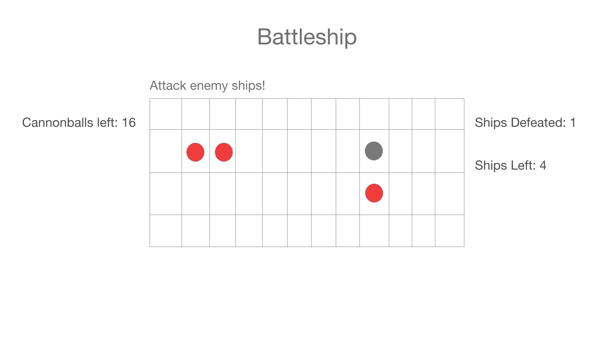

# Battleship

## User Story
1. When the player clicks on a square in the grid and a hidden boat is there, the square will light up red. Else, it will light up gray
2. When player clicks a certain determined number of times and has not clicked on all the hidden ship squares, the game will end.
3. When player clicks on all hidden ship squares, the game will end and a winning message will appear
4. When player clicks on reset button, the board will reset and the hidden boats reshuffled randomly across the board

## Wireframes
