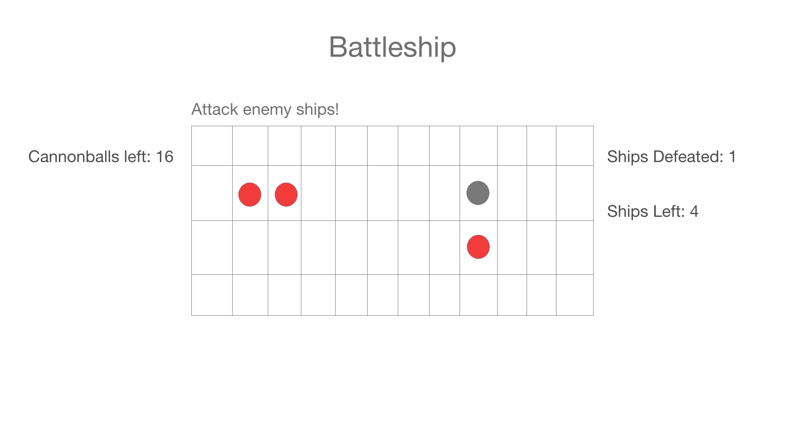

# Battleship

## Intro
This is a collection of two battleship games. There is a one player option where the player can try to find all the ships hidden on the board with a limited number of cannonballs. There is also a two player option where both players can place 4 ships on their board and then battle each other by competing to see who can sink all of the other's ships first.

## Technology and Approach
This app is made entirely with HTML, CSS, and Javascript. Both games work in similar ways. 

At it's most basic, I created a table with 8 rows and 8 columns to act as the board that is connected to an array holding the values of hidden ships. When the player clicks on the table, a click event will check for the index within the table of the square clicked and check that same index in the connected ships array to see if that square contained a ship. If so, a red div will appear. If not, a grey div will appear.

The one player game starts with a board being filled with 7 ships and then being randomly shuffled. Every time the user clicks on the board, their remaining cannonballs decrease. The game ends whether the user runs out of all cannonballs (loss) or the user finds all of the ships (win). Click events are then removed and a winning or losing message appears.

The two player game is much more complex. The game basically runs on a sequence of functions that act as different stages of the game: initialize, initializeShips, and play. The initialize function initializes all of the variables and event listeners to make the game ready to start. InitializeShips begins the phase where players can hide 4 ships on their board. Play begins the phase where players attack the other player's board searching for their ships, one at a time. There are several other functions (ie selectShips, handleGuess) that are called as click event listeners during the first and second gameplay phase. 

## User Story
One Player
1. The player clicks on a square in the grid. If a hidden boat is there, the square will light up red. Else, it will light up gray
2. Once the player clicks a certain determined number of times and has not clicked on all the hidden ship squares, the game will end and a losing message will appear.
3. If instead the player clicks on all hidden ship squares, the game will end and a winning message will appear
4. When player clicks on reset button, the board will reset to be blank and the hidden boats reshuffled randomly across the board.

Two Player
1. Player one clicks on 3 adjacent squares to create a ship and repeats this process a total of 4 times.
2. Player one clicks the "Next" button and slides the screen to player two to select their ships.
3. Player two now clicks on 3 adjacent squares 4 times to select their ships.
4. Player two clicks the "Next" button.
5. Player one clicks a square on the grid to guess where a ship is. Hit or miss is displayed and the map is marked with their choice. If a ship has been sunk, the UI will update.
6. Player one clicks the "Next" button.
7. Player two clicks the grid to guess where a ship is. All the same things occur.
8. When one player has found all of the other player's ships, a win message will appear and the game ends.

## Wireframes

